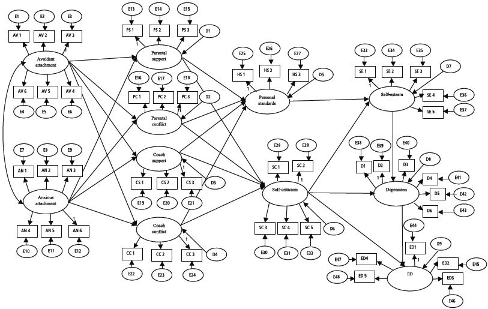

```{r, echo=FALSE, message=FALSE, warning=FALSE}
library(mgcv)
library(lme4)
library(tidyverse)
library(ggthemes)
theme_set(theme_bw())
theme_update(panel.grid = element_blank())
```

## Latent Traits - When you Can't Measure the Real Thing


- Working memory

  - Digit span tests - how long sequence of number can you remember?
  
- Conservative vs liberal

  - Questionnaires with a bunch of statements to evaluate
  
- How well you know a subject

  - Measured by exam score

---


class: inverse, middle, center

# Latent Variable Models


---

## Confirmatory Factor Analysis

A set of items measure some underlying construct(s)

$$\mathbf{y}_{j} = \boldsymbol{\Lambda} \boldsymbol{\eta}_{j} + \boldsymbol{\epsilon}_{j}, \qquad \boldsymbol{\eta}_{j} \sim N\left(\mathbf{0}, \boldsymbol{\Psi}\right)$$


---

## Item Response Theory

Kind of factor analysis with binomial measurements:

$$\mathbf{y}_{j} \sim \text{Binomial}\left(\boldsymbol{\mu}_{j}\right)$$ 

Predictor

$$\boldsymbol{\nu}_{j} = \log\left(\frac{\boldsymbol{\mu}_{j}}{\mathbf{1} - \boldsymbol{\mu}_{j}}\right) =  \mathbf{X}\boldsymbol{\beta} + \boldsymbol{\Lambda} \boldsymbol{\eta}_{j}, \qquad \boldsymbol{\eta}_{j} \sim N\left(\mathbf{0}, \boldsymbol{\Psi}\right)$$


---

## Structural Equation Models




.footnote[Heard about the replication crisis?]

---


## Structural Equation Models

Extend confirmatory factor models so latent traits can depend on each other and on predictors.

- Measurement model for response:

$$\mathbf{y}_{j} = \boldsymbol{\Lambda}_{y} \boldsymbol{\eta}_{j} + \boldsymbol{\epsilon}_{j}$$

- Measurement model for predictors:

$$\mathbf{x}_{j} = \boldsymbol{\Lambda}_{x} \boldsymbol{\xi}_{j} + \boldsymbol{\delta}_{j}, \qquad \boldsymbol{\xi}_{j} \sim N\left(\mathbf{0}, \boldsymbol{\Psi}_{x}\right)$$

- Structural model:

$$\boldsymbol{\eta}_{j} = \mathbf{B}\boldsymbol{\eta}_{j} + \boldsymbol{\Gamma} \boldsymbol{\xi}_{j} + \boldsymbol{\zeta}_{j}, \qquad \boldsymbol{\zeta}_{j} \sim N\left(\mathbf{0}, \boldsymbol{\Psi}\right)$$

---


## Generalized Linear Mixed Models

Response from exponential family, and mean

$$\boldsymbol{\mu}_{j} = g^{-1}\left(\mathbf{X}_{j} \boldsymbol{\beta} + \mathbf{Z}_{j} \boldsymbol{\eta}_{j}\right),  \qquad \boldsymbol{\eta}_{j} \sim N\left(\mathbf{0}, \boldsymbol{\Psi}\right)$$


---

class: inverse, middle, center

# Can we combine the best of these models?

---

class: inverse, middle, center

# GLLAMM: Generalized Linear Latent and Mixed Models<sup>1</sup>


.footnote[[1] Rabe-Hesketh, S., Skrondal, A., & Pickles, A. (2004). Generalized multilevel structural equation modeling. Psychometrika, 69(2), 167--190. https://doi.org/10.1007/BF02295939]

---


## GLLAMM


- Response in exponential family. Can be of mixed type, i.e., link function, cumulant, dispersion, etc. vary between observations.

- $L$ grouping levels. $M_{l}$ latent variables at $l$th level.

Linear predictor for an elementary response unit:

$$\nu_{i} = \mathbf{x}_{i}^{T}\boldsymbol{\beta} + \sum_{l=2}^{L} \sum_{m=1}^{M_{l}} \eta_{m}^{(l)} \mathbf{z}_{mi}^{(l)}{}^{T} \boldsymbol{\lambda}_{m}^{(l)}$$

Structural model

$$\boldsymbol{\eta}_{j} = \mathbf{B}\boldsymbol{\eta}_{j} +\boldsymbol{\Gamma} \mathbf{w}_{j} + \boldsymbol{\zeta}_{j}, \qquad \boldsymbol{\zeta}_{j} \sim N\left(\mathbf{0}, \boldsymbol{\Psi}\right)$$


---

## GLLAMM

Lots of applications in the social sciences, but there are some limitations:

1. Strictly parametric.

2. Algorithms assume nested random effects and scale poorly.

3. Stata based. Limited availability in R.

We'll address these things one at a time.


---

class: inverse, middle, center

# Thing 1

"GLLAMMs are strictly parametric."


---

## Semiparametric Estimation often Needed

Figures show number of digits repeated forward or backward against age. Easier to have the model learn the relationship, than to assume some nonlinear parametric model.


---

## Generalized Additive Latent and Mixed Models 

We extend the GLLAMM framework to incorporate smooth functions of observed variables.

- Linear predictor

$$\nu_{i} = \sum_{s=1}^{S}f_{s}\left(\mathbf{x}_{i}\right) + \sum_{l=2}^{L} \sum_{m=1}^{M_{l}} \eta_{m}^{(l)} \mathbf{z}_{mi}^{(l)}{}^{T} \boldsymbol{\lambda}_{m}^{(l)}$$

- Structural model

$$\boldsymbol{\eta}_{j} = \mathbf{B}\boldsymbol{\eta}_{j} + \mathbf{h}\left( \mathbf{w}_{j} \right) + \boldsymbol{\zeta}_{j}, \qquad \boldsymbol{\zeta}_{j} \sim N\left(\mathbf{0}, \boldsymbol{\Psi}\right)$$

Smooth functions $f_{s}(\cdot)$ and $\mathbf{h}(\cdot)$ are linear combinations of known basis functions (regression splines), with squared second derivative penalization.


---

## Semiparametric Estimation

Might have a basis like this.

```{r, echo=FALSE, dev='svg', fig.height=3.5, fig.width=7, fig.align='center'}
set.seed(2) ## simulate some data... 
dat <- gamSim(1,n=400,dist="normal",scale=2, verbose=FALSE)

mod <- gam(y ~ s(x2, k = 6, bs = "cr"), data = dat, method="ML")
dat <- dat %>% 
  mutate(pred = predict(mod))

Xp <- predict(mod, type = "lpmatrix")
p0 <- as_tibble(Xp) %>% 
  mutate(x2 = dat$x2) %>% 
  pivot_longer(cols = -x2) %>% 
  ggplot(aes(x = x2, y = value, group = name, color = name)) + 
  geom_line() +
  scale_color_colorblind() +
  labs(color = NULL)
  
sm <- smoothCon(s(x2, k = 6, bs = "cr"), data = dat)[[1]]
re <- smooth2random(sm, "")
pm <- cbind(attr(re$rand$g, "Xr"), re$Xf)
colnames(pm) <- paste0("s", 1:ncol(pm))

grid <- as_tibble(pm) %>% 
  mutate(x2 = dat$x2) %>% 
  pivot_longer(cols = -x2) %>% 
  mutate(
    type = case_when(
      str_detect(name, "[1-4]") ~ "Random effect terms",
      TRUE ~ "Fixed effect terms"
    )
  )

p1 <- ggplot(grid, aes(x = x2, y = value, group = name, color = name)) + 
  geom_line() +
  labs(color = NULL) +
  scale_color_colorblind()

p0
```


---

## Semiparametric Estimation

Transform into one part in the range space of the second derivative penalty matrix and one part in the nullspace.

```{r, echo=FALSE, dev='svg', fig.height=3.5, fig.width=6, fig.align='center'}
p1
```


---

## Semiparametric Estimation

Transform into one part in the range space of the second derivative penalty matrix and one part in the nullspace.

```{r, echo=FALSE, dev='svg', fig.height=3.5, fig.width=8, fig.align='center'}
p1 + 
  facet_wrap(vars(type)) +
  ggtitle("Second derivative penalization")
```


.footnote[Dates back to: Kimeldorf, G. S., & Wahba, G. (1970). A Correspondence Between Bayesian Estimation on Stochastic Processes and Smoothing by Splines. Annals of Mathematical Statistics, 41(2), 495–502. https://doi.org/10.1214/aoms/1177697089
]


---

## Mixed Model View of Semiparametric Estimation

- Estimate mixed model and then transform back.

$$\mathbf{y} = \mathbf{X} \boldsymbol{\beta} + \mathbf{Z} \boldsymbol{\eta} + \boldsymbol{\epsilon}, \qquad \boldsymbol{\eta} \sim N\left(\mathbf{0}, \boldsymbol{\Psi}\right)$$

- Inverse regularization parameter represented by $\boldsymbol{\Psi}$. Empirical Bayes essentially.


---

## GLLAMMs with Semiparametric Functions

- Using the same trick, we represent an $L$-level GALAMM as an $(L+1)$-level GLLAMM.

--

- Gets a bit nasty due to the presence of so many other latent variables. In the words of reviewer 2

> ... the notation in this paper is so dreadful that I considered declining to review it. If the notation is not thoroughly cleaned up in a revision, I will not review it again. I only begin to touch the surface in these comments.
(...) The lack of consistency seems almost sadistic, as if it was done to purposively make even simple expressions inscrutable! 


---

class: inverse, middle, center

# Anyhow


---

class: inverse, middle, center

# Thing 2

"Algorithms assume nested random effects and scale poorly."


---

class: inverse, middle, center

# A Scalable Algorithm

Laplace Approximation, Sparse Matrices, and Autodiff to the rescue

---

# Likelihood

- We transform latent variables through $\boldsymbol{\Lambda} \mathbf{u} = \boldsymbol{\zeta}$, where $\boldsymbol{\Lambda}^{T}\boldsymbol{\Lambda} = \boldsymbol{\Psi}$, so $\mathbf{u} \sim N(\mathbf{0}, \phi \mathbf{I})$ <sup>1</sup>.


- The marginal likelihood, integrating over $\mathbf{u} \in \mathbb{R}^{r}$ is

$$L = \frac{1}{\left(2 \pi \phi\right)^{-r/2}}\int_{\mathbb{R}^{r}} \exp\left(\sum_{i=1}^{n}\frac{y_{i}\nu_{i} - d(\nu_{i})}{a(\phi)} + \sum_{i=1}^{n}c\left(y_{i},\phi\right) - \frac{\left\|\mathbf{u}\right\|^{2}}{2 \phi}\right) \text{d}\mathbf{u}$$

- Just like a generalized linear mixed model, except that **everything depends on the factor loadings and coefficients for regressions between latent variables**. A nonlinear model in other words. 


.footnote[[1] This Greek L is a Cholesky factor and not a factor loading. I guess you sympathise with reviewer 2 now.]

---

## Laplace Approximation

- First goal, evaluate likelihood at given values of the parameters, of which there are many ( $\boldsymbol{\beta}$, $\boldsymbol{\Gamma}$, $\boldsymbol{\Psi}$, $\boldsymbol{\lambda}$, $\phi$, $\mathbf{B}$).

- Laplace approximation, conditional mode $\hat{\mathbf{u}}$ is

$$\text{argmax}\left\{\sum_{i=1}^{n}\frac{y_{i}\nu_{i} - d(\nu_{i})}{a(\phi)} + \sum_{i=1}^{n}c\left(y_{i},\phi\right) - \frac{\left\|\mathbf{u}\right\|^{2}}{2 \phi}\right\} = \text{argmax}\left\{g\right\}$$


---

## Laplace Approximation

- Analytical expressions for gradient and Hessian<sup>1</sup>

$$\nabla g = \frac{\partial g}{\partial \mathbf{u}} = \frac{1}{\phi}\left(\boldsymbol{\Lambda}^{T}\mathbf{Z}^{T}\left(\mathbf{y} - \boldsymbol{\mu}\right) - \mathbf{u}\right)$$

$$\nabla^{2} g = \frac{\partial^{2}g}{\partial \mathbf{u} \partial \mathbf{u}^{T}} = \frac{-1}{\phi} \left(\boldsymbol{\Lambda}^{T}\mathbf{Z}^{T} \mathbf{V}\boldsymbol{\Lambda}\mathbf{Z} + \mathbf{I}_{r} \right)$$

- Penalized iterative reweighted least squares scheme for finding $\hat{\mathbf{u}}$, by solving linear system

$$\left(\nabla^{2}g\right) \boldsymbol{\delta}_{\mathbf{u}} = \nabla{g}$$

and then updating $\mathbf{u}^{(k+1)} = \mathbf{u}^{(k)} + \boldsymbol{\delta}_{\mathbf{u}}$.

.footnote[[1] Pinheiro, J. C., & Chao, E. C. (2006). Efficient Laplacian and Adaptive Gaussian Quadrature Algorithms for Multilevel Generalized Linear Mixed Models. Journal of Computational and Graphical Statistics, 15(1), 58–81. https://doi.org/10.1198/106186006X96962
]

---

## Laplace Approximation

- Linear system

$$\left(\nabla^{2}g\right) \boldsymbol{\delta}_{\mathbf{u}} = \nabla{g}$$

- Hessian $\nabla^{2}g$ is typically **really really sparse**.

- We follow Bates et al. (2015). Sparse Cholesky factorization

$$\mathbf{L} \mathbf{D} \mathbf{L}^{T} = \mathbf{P} \left(\nabla^{2}g\right) \mathbf{P}^{T}$$
- Fill-reducing permutation $\mathbf{P}$ only depends on location of structural zeros, so can be computed off-line.

- $\mathbf{L}$ and $\mathbf{D}$ updated for new parameter values, and used in iteration for finding $\hat{\mathbf{u}}$ at these parameters.


.footnote[Bates, D. M., Mächler, M., Bolker, B., & Walker, S. (2015). Fitting Linear Mixed-Effects Models Using lme4. Journal of Statistical Software, 67(1), Article 1. https://doi.org/10.18637/jss.v067.i01
]


---

## Log-Likelihood

- Inserting conditional modes, the log-likelihood becomes

$$L = \sum_{i=1}^{n}\frac{y_{i}\nu_{i} - d(\nu_{i})}{a(\phi)} + \sum_{i=1}^{n}c\left(y_{i},\phi\right) - \frac{\left\|\hat{\mathbf{u}}\right\|^{2}}{2 \phi} - \frac{1}{2} \log\left\{ \text{trace}(\mathbf{D}) \right\}$$

- We know how to evaluate $L$ at given parameters, and now need to maximize it. 

- Having the gradient of $L$ with respect to the parameters, we can use quasi-Newton method L-BFGS-B to solve the constrained optimization problem.


---

## Differentiating Log-Likelihood

- Sparse matrix computations in C++ using Eigen (https://eigen.tuxfamily.org/).

- Rather than `float` or `double`, we fill the Eigen matrices with dual numbers from autodiff (https://autodiff.github.io/), tracing derivatives in the computational graph.

  - First-order dual numbers during optimization with L-BFGS-B to get gradient.
  - Second-order dual numbers at convergence, to get exact Hessian, and thus covariance matrix.
  
--

- Updating $\mathbf{X}$ and $\mathbf{Z}$ at each likelihood evaluation, since they contain parameters. Solved by mapping parameters to values in the compressed sparse column representation of sparse matrices.

- Mapping between R and C++ objects using RcppEigen, and base R's `optim()` function for likelihood maximization.


---

## Autodiff

- Scalar valued function `f()` taking vector arguments

```{Rcpp, eval=FALSE}
#include <autodiff/forward/dual.hpp>
#include <autodiff/forward/dual/eigen.hpp>
using namespace autodiff;

template <typename T>
T f(const Eigen::Array<T, Eigen::Dynamic, 1>& x)
{
    return (x * x.exp()).sum();
}

```


---

## Autodiff

- Scalar type defines what you can get:

```{Rcpp, eval=FALSE}
int main()
{
    ArrayXdual1st x(5); // 1st derivative = gradient
    x << 1, 2, 3, 4, 5;
    Eigen::VectorXd g = gradient(f<dual1st>, wrt(x), at(x));
    
    ArrayXdual2nd y(5); // 2nd derivative = Hessian
    y << 1, 2, 3, 4, 5;
    Eigen::MatrixXd H = hessian(f<dual2nd>, wrt(y), at(y));
    
    Eigen::ArrayX<double> z(5); // only function value
    z << 1, 2, 3, 4, 5;
    double u = f<double>(z);
}
```


- Log-likelihood implementation for GALAMMs contains classes, header files, branching, and loops, but autodiff faithfully gives exact derivatives.

---

class: inverse, middle, center


# Thing 3

Stata based. Limited availability in R.


---

## Implementation

- R package `galamm`, so far only at https://github.com/LCBC-UiO/galamm.

- Supports a wide range of models, including

  - Mixed response types
  
  - Crossed random effects
  
  - Semiparametric terms
  
  - Heteroscedasticity
  

- User-friendly API will come when numerics is settled.


---

class: inverse, middle, center

# Further Work

---

## Further Work

- Improve Laplace approximation by importance sampling or by including higher-order terms.

- Allow smooth terms to be functions of latent variables. Leads to products of latent variables in the likelihood, distributed as a linear combination of two $\chi^{2}$ distributed random variables. Thus requires replacing Laplace approximation with something else.

- Utilize the framework to answer research questions in cognitive neuroscience.


Interested in joining? Postdoc position will soon be announced. Contact me for details.


---

class: inverse, middle, center
 
# Thank you

---

class: inverse, middle, center


Isaac Newton and his brother John Quasi Newton inventing the rainbow.
