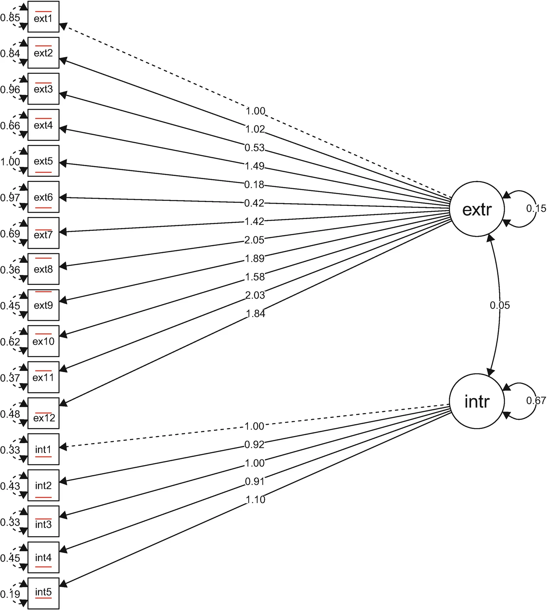
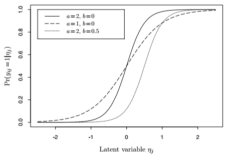
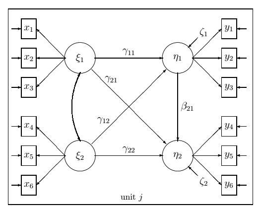
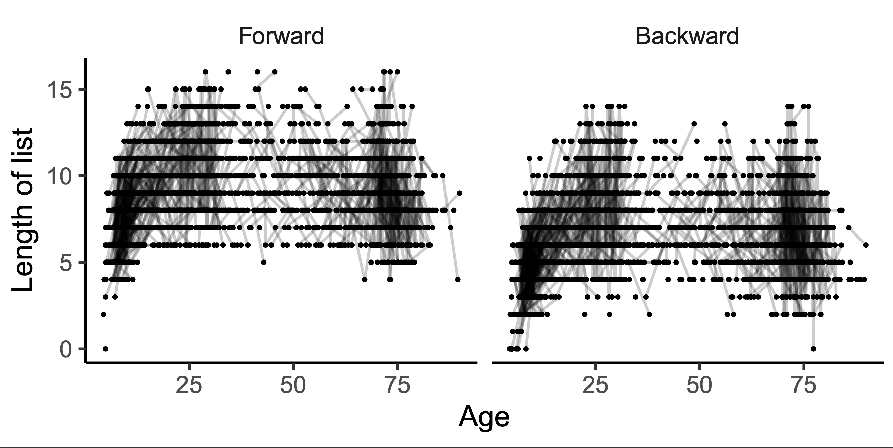
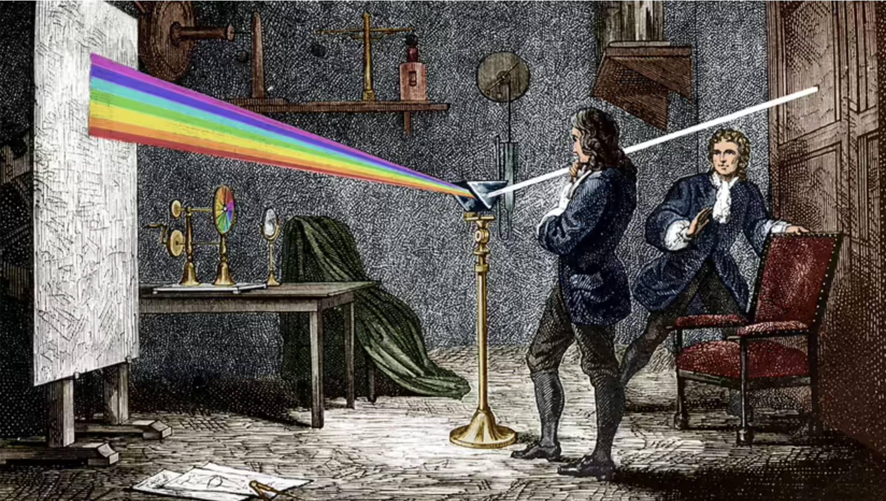
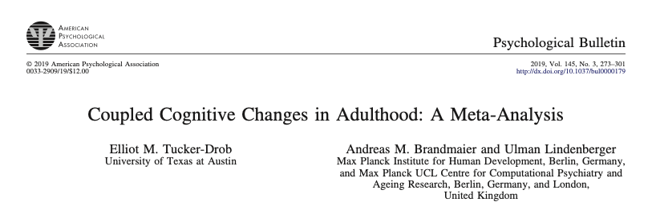
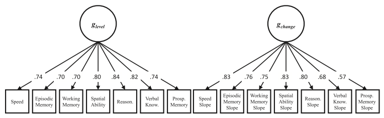
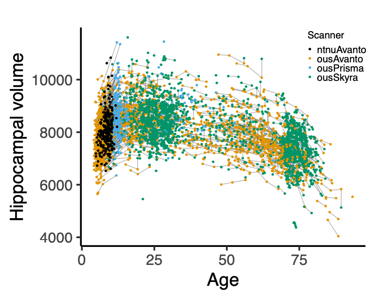

```{r, echo=FALSE, message=FALSE, warning=FALSE}
library(mgcv)
library(lme4)
library(tidyverse)
library(ggthemes)
theme_set(theme_bw())
theme_update(panel.grid = element_blank())
```


# Outline

- Overview of latent variable models

- A framework for semiparametric latent variable modeling

- Maximum likelihood estimation

- Applications


---

class: inverse, middle, center

# Overview of Latent Variable Models


---

## Confirmatory Factor Analysis

A set of items measure some underlying construct(s)

$$\mathbf{y}_{j} = \boldsymbol{\Lambda} \boldsymbol{\eta}_{j} + \boldsymbol{\epsilon}_{j}, \qquad \boldsymbol{\eta}_{j} \sim N\left(\mathbf{0}, \boldsymbol{\Psi}\right)$$

<br>
<center>

</center>

---

## Item Response Theory

- Kind of factor analysis with binomial measurements $\mathbf{y}_{j} \sim \text{Binom}\left(\boldsymbol{\mu}_{j}\right)$.

- Predictor for item $i$, subject $j$

$$\nu_{ij} = a_{i} (\eta_{j} - b_{i})$$


<center>

</center>

---


## Structural Equation Models

<center>

</center>


---


## Structural Equation Models


- Measurement model for response:

$$\mathbf{y}_{j} = \boldsymbol{\Lambda}_{y} \boldsymbol{\eta}_{j} + \boldsymbol{\epsilon}_{j}, \qquad \boldsymbol{\epsilon}_{j} \sim N(\mathbf{0}, \boldsymbol{\Psi}_{y})$$

- Measurement model for predictors:

$$\mathbf{x}_{j} = \boldsymbol{\Lambda}_{x} \boldsymbol{\xi}_{j} + \boldsymbol{\delta}_{j}, \qquad \boldsymbol{\xi}_{j} \sim N\left(\mathbf{0}, \boldsymbol{\Psi}_{x}\right)$$

- Structural model:

$$\boldsymbol{\eta}_{j} = \mathbf{B}\boldsymbol{\eta}_{j} + \boldsymbol{\Gamma} \boldsymbol{\xi}_{j} + \boldsymbol{\zeta}_{j}, \qquad \boldsymbol{\zeta}_{j} \sim N\left(\mathbf{0}, \boldsymbol{\Psi}\right)$$

---


## Generalized Linear Mixed Models

- Response $\mathbf{y}_{j}$ from exponential family with mean $\boldsymbol{\mu}_{j}$

- $\boldsymbol{\mu}_{j}$ depends on latent variables $\boldsymbol{\eta}_{j}$

$$\boldsymbol{\mu}_{j} = g^{-1}\left(\mathbf{X}_{j} \boldsymbol{\beta} + \mathbf{Z}_{j} \boldsymbol{\eta}_{j}\right),  \qquad \boldsymbol{\eta}_{j} \sim N\left(\mathbf{0}, \boldsymbol{\Psi}\right)$$


---

class: inverse, middle, center

# Generalized Linear Latent and Mixed Models

All models mentioned above, and many more, are special cases of GLLAMM.

.footnote[Rabe-Hesketh, S., Skrondal, A., & Pickles, A. (2004). Generalized multilevel structural equation modeling. Psychometrika, 69(2), 167--190. https://doi.org/10.1007/BF02295939]

---


## GLLAMM


- Exponential family response, possibly of mixed type.

- $L$ grouping levels. $M_{l}$ latent variables at $l$th level.

Linear predictor for observational unit $i$

$$\nu_{i} = \mathbf{x}_{i}^{T}\boldsymbol{\beta} + \sum_{l=2}^{L} \sum_{m=1}^{M_{l}} \eta_{m}^{(l)} \mathbf{z}_{mi}^{(l)}{}^{T} \boldsymbol{\lambda}_{m}^{(l)}$$

Structural model for cluster $j$

$$\boldsymbol{\eta}_{j} = \mathbf{B}\boldsymbol{\eta}_{j} +\boldsymbol{\Gamma} \mathbf{w}_{j} + \boldsymbol{\zeta}_{j}, \qquad \boldsymbol{\zeta}_{j} \sim N\left(\mathbf{0}, \boldsymbol{\Psi}\right)$$


---

## GLLAMM

Lots of applications, but some limitations:

1. Strictly parametric.

2. New results on mixed model estimation can be used to speed up the algorithms, particularly for crossed random effects.

3. Stata based. Limited availability in R.

We'll address these things one at a time.


---

class: inverse, middle, center

# Thing 1

"GLLAMMs are strictly parametric."


---

## Semiparametric Estimation often Needed

- The world is nonlinear.

- Easier and safer to learn the nonlinear form from the data, rather than pulling a parameteric model out of the hat.

Example: how many words people remember, plotted against age.

<center>

</center>


---

## Generalized Additive Latent and Mixed Models 

Extension of GLLAMM framework to incorporate smooth functions of observed variables.

- Linear predictor

$$\nu_{i} = \color{red}{\sum_{s=1}^{S}f_{s}\left(\mathbf{x}_{i}\right)} + \sum_{l=2}^{L} \sum_{m=1}^{M_{l}} \eta_{m}^{(l)} \mathbf{z}_{mi}^{(l)}{}^{T} \boldsymbol{\lambda}_{m}^{(l)}$$

- Structural model

$$\boldsymbol{\eta}_{j} = \mathbf{B}\boldsymbol{\eta}_{j} + \color{red}{\mathbf{h}\left( \mathbf{w}_{j} \right)} + \boldsymbol{\zeta}_{j}, \qquad \boldsymbol{\zeta}_{j} \sim N\left(\mathbf{0}, \boldsymbol{\Psi}\right)$$

- $f_{s}(\cdot)$ and $\mathbf{h}(\cdot)$ composed of regression splines. Second derivative penalization.


---

## GLLAMMs with Semiparametric Functions

- Semiparametric model can be represented by a standard GLLAMM.

  - Part of basis in penalty nullspace becomes fixed effects.

  - Part of basis in penalty range space becomes random effects.

  - Inverse smoothing parameters become new variance components.

--

- Gets a bit nasty. In the words of reviewer 3

> ... the notation in this paper is so dreadful that I considered declining to review it. If the notation is not thoroughly cleaned up in a revision, I will not review it again. I only begin to touch the surface in these comments.
(...) The lack of consistency seems almost sadistic, as if it was done to purposively make even simple expressions inscrutable! 


---

class: inverse, middle, center

# Anyhow


---

class: inverse, middle, center

# Thing 2

"New results on mixed model estimation can be used to speed up the algorithms, particularly for crossed random effects."


---

class: inverse, middle, center

# A Scalable Algorithm

Laplace approximation, sparse matrices, and autodiff to the rescue

---

# Likelihood

- Transform latent variables through $\boldsymbol{\Lambda} \mathbf{u} = \boldsymbol{\zeta}$, where $\boldsymbol{\Lambda}^{T}\boldsymbol{\Lambda} = \boldsymbol{\Psi}$, so $\mathbf{u} \sim N(\mathbf{0}, \phi_{1} \mathbf{I})$. $\phi_{1}$ is a reference level, since the dispersion may differ between observations.


--


- The marginal likelihood, integrating over $\mathbf{u} \in \mathbb{R}^{r}$ is

$$L\left(\boldsymbol{\beta}, \boldsymbol{\Lambda}, \boldsymbol{\Gamma}, \boldsymbol{\lambda}, \mathbf{B}, \boldsymbol{\phi}\right)  = \\ \left(2 \pi \phi_{1}\right)^{-r/2}  \int_{\mathbb{R}^{r}} \exp\left( g\left(\boldsymbol{\beta}, \boldsymbol{\Lambda}, \boldsymbol{\Gamma}, \boldsymbol{\lambda}, \mathbf{B}, \boldsymbol{\phi}, \mathbf{u}\right) \right) \text{d} \mathbf{u}$$

where

$$g\left(\boldsymbol{\beta}, \boldsymbol{\Lambda}, \boldsymbol{\Gamma}, \boldsymbol{\lambda}, \mathbf{B}, \boldsymbol{\phi}, \mathbf{u}\right) = \\ 
\mathbf{y}^{T} \mathbf{W}\boldsymbol{\nu} - d\left(\boldsymbol{\nu}\right)^{T} \mathbf{W}\mathbf{1}_{n}  + c\left(\mathbf{y}, \boldsymbol{\phi}\right)^{T} \mathbf{1}_{n} - \left(2\phi_{1}\right)^{-1} \left\| \mathbf{u} \right\|^{2}$$

- Just like a generalized linear mixed model, except that everything depends on the factor loadings and coefficients for regressions between latent variables. Doubly nonlinear in a sense.


---

## Laplace Approximation

- First goal, maximize the exponent in the integrand at fixed parameters.

$$\tilde{\mathbf{u}} = \underset{\mathbf{u}}{\text{argmax}} \left\{ g\left(\boldsymbol{\beta}, \boldsymbol{\Lambda}, \boldsymbol{\Gamma}, \boldsymbol{\lambda}, \mathbf{B}, \phi, \mathbf{u}\right) \right\}$$

--

- Analytical expressions for gradient and Hessian

$$\nabla g = \boldsymbol{\Lambda}^{T} \mathbf{Z}^{T} \mathbf{W}\left( \mathbf{y} - \boldsymbol{\mu} \right)  - \left(1/\phi_{1}\right)\mathbf{u}$$

$$\mathbf{H}_{g} =-  \boldsymbol{\Lambda}^{T} \mathbf{Z}^{T} \mathbf{V}  \mathbf{Z} \boldsymbol{\Lambda} - \left(1/\phi_{1}\right) \mathbf{I}_{r}$$

- Full Newton method:

$$ \mathbf{H}_{g}^{(k)}\boldsymbol{\delta}^{(k)} =  \nabla g^{(k)}$$

and then updating $\mathbf{u}^{(k+1)} = \mathbf{u}^{(k)} + \gamma \boldsymbol{\delta}^{(k)}$ for some adaptively chosen stepsize $\gamma$.


---

## Laplace Approximation

- Linear system

$$\mathbf{H}_{g}^{(k)}\boldsymbol{\delta}^{(k)} = \nabla g^{(k)}$$

- Hessian $\mathbf{H}_{g}^{(k)}$ is typically **really really sparse**. Sparse Cholesky factorization

$$\mathbf{L}^{(k)} \mathbf{D}^{(k)} \mathbf{L}^{(k)}{}^{T} = \mathbf{P} \mathbf{H}_{g}^{(k)}\mathbf{P}^{T}$$

- Fill-reducing permutation $\mathbf{P}$ only depends on location of structural zeros, so can be computed off-line.

--

- The system we solve, $Ax=b$, is

$$\underbrace{\mathbf{L}^{(k)} \mathbf{D}^{(k)} \mathbf{L}^{(k)T} \mathbf{P}}_{A} \underbrace{\boldsymbol{\delta}^{(k)}}_{x} = \underbrace{\mathbf{P} \left( \boldsymbol{\Lambda}^{T} \mathbf{Z}^{T} \mathbf{W}^{(k)} \left( \mathbf{y} - \boldsymbol{\mu}^{(k)}\right)- (1/\phi_{1}^{(k)}) \mathbf{u}^{(k)}\right)}_{b}$$


---

## Log-Likelihood

- At convergence, plug in conditional modes $\tilde{\mathbf{u}}$ and update terms that depend on $\mathbf{u}$.

- Laplace approximate marginal log-likelihood

$$\log L\left(\boldsymbol{\beta}, \boldsymbol{\Lambda}, \boldsymbol{\Gamma}, \boldsymbol{\lambda}, \mathbf{B}, \boldsymbol{\phi}\right) = \\ \mathbf{y}^{T} \mathbf{W}\boldsymbol{\nu} - d\left(\boldsymbol{\nu}\right)^{T} \mathbf{W}\mathbf{1}_{n}  + c\left(\mathbf{y}, \boldsymbol{\phi}\right)^{T} \mathbf{1}_{n} - \left(2\phi_{1}\right)^{-1} \left\| \tilde{\mathbf{u} }\right\|^{2} - (1/2)\log \text{tr}\left(\mathbf{D}\right)$$

---

# Maximizing the Marginal Likelihood

- Extend C++ library `Eigen` to allow sparse matrix computations with dual types from `autodiff`, rather than `double`/`float`.
  
- Exact gradients of log-likelihood wrt all parameters plugged into quasi-Newton L-BFGS-B algorithm to find maximum.

- At convergence, exact Hessian computed using second-order dual numbers.


.footnote[https://eigen.tuxfamily.org/, https://autodiff.github.io/]

---

class: inverse, middle, center



Isaac and his cousin Fred Quasi-Newton inventing the rainbow.

---

class: inverse, middle, center


# Thing 3

Stata based. Limited availability in R.


---

## Implementation

- R package `galamm`, so far only at https://lcbc-uio.github.io/galamm/.

- Supports a wide range of models, including

  - Mixed response types
  
  - Crossed random effects
  
  - Semiparametric terms
  
  - Heteroscedasticity
  

- User-friendly API will come when smoke has cleared.


---

class: inverse, middle, center

# Application Examples


---


# Coupled Cognitive Change

<center>

<br>
<br>
<br>

</center>


---

# Coupled Cognitive Change


---

# Effect of Socioeconomic Status on the Brain

- A Lancet report has suggested that low socioeconomic status is a risk factor for late life dementia, through its impact on brain structure.

- Lifespan brain development is pretty nonlinear. Example below shows volume of hippocampus. How does socioeconomic status interact with this curve?

<center>

</center>

---

# Effect of Socioeconomic Status on the Brain


- Latent socioeconomic status defined by income and education level. For children, parents' values were used.

- The model:

$$y_{i} = \mathbf{d}_{\text{s},i}'\boldsymbol{\beta}_{\text{s}} + d_{h,i}\left\{ \mathbf{x}_{\text{h},i}' \boldsymbol{\beta}_{\text{h}} + f\left(a_{i}\right)\right\} +  \eta_{1} \mathbf{z}_{i}' \boldsymbol{\lambda} + d_{\text{h},i} \eta_{2} + \epsilon_{i}$$

- Terms:

  - $\mathbf{d}_{s,i}$, dummy for socioeconomic status items.
  - $d_{h,i}$: dummy for hippocampus volume.
  - $f(a_{i})$ effect of age on hippocampus volume.
  - $\eta_{1}$: latent socioeconomic status.
  - $\eta_{2}$: random intercept for hippocampus volume.
  - $\epsilon_{i}$: residual varying between groups of variables (income, education, hippocampus).
  

---

# Effect of Socioeconomic Status on the Brain


- The model:

$$y_{i} = \mathbf{d}_{\text{s},i}'\boldsymbol{\beta}_{\text{s}} + d_{h,i}\left\{ \mathbf{x}_{\text{h},i}' \boldsymbol{\beta}_{\text{h}} + f\left(a_{i}\right)\right\} +  \eta_{1} \mathbf{z}_{i}' \boldsymbol{\lambda} + d_{\text{h},i} \eta_{2} + \epsilon_{i}$$

- When $i$ is a hippocampus measurement, $\mathbf{z}_{i} = (1,a_{i})'$ and $\boldsymbol{\lambda}$ contains offset and interaction effect of latent socioeconomic status on hippocampus volume.


---

# Effect of Socioeconomic Status on the Brain

.pull-left[

- We found no evidence of interaction effect, but some evidence of an offset effect.

- Consistent with the hypothesis that socioeconomic status mainly affects early-life brain developement. Or just lack of power.

] 
.pull-right[

]


---

class: inverse, middle, center

# Further Work

---

## Further Work

- Study the accuracy of Laplace approximation through importance sampling.

- Let smooth functions depend on latent variables. Leads to $\chi^{2}$ distributed random variables.

- Optimize code and create descent API.

- Utilize the framework to answer research questions in cognitive neuroscience.


Interested in working with similar applications? Postdoc position will soon be announced. Contact me for details.


---

class: inverse, middle, center

# Some Additional Details

---

class: inverse, middle, center

# Transformation from GALAMM to GLLAMM


---

## Semiparametric Estimation

Might have a basis like this.

```{r, echo=FALSE, dev='svg', fig.height=3.5, fig.width=7, fig.align='center'}
set.seed(2) ## simulate some data... 
dat <- gamSim(1,n=400,dist="normal",scale=2, verbose=FALSE)

mod <- gam(y ~ s(x2, k = 6, bs = "cr"), data = dat, method="ML")
dat <- dat %>% 
  mutate(pred = predict(mod))

Xp <- predict(mod, type = "lpmatrix")
p0 <- as_tibble(Xp) %>% 
  mutate(x2 = dat$x2) %>% 
  pivot_longer(cols = -x2) %>% 
  ggplot(aes(x = x2, y = value, group = name, color = name)) + 
  geom_line() +
  scale_color_colorblind() +
  labs(color = NULL)
  
sm <- smoothCon(s(x2, k = 6, bs = "cr"), data = dat)[[1]]
re <- smooth2random(sm, "")
pm <- cbind(attr(re$rand$g, "Xr"), re$Xf)
colnames(pm) <- paste0("s", 1:ncol(pm))

grid <- as_tibble(pm) %>% 
  mutate(x2 = dat$x2) %>% 
  pivot_longer(cols = -x2) %>% 
  mutate(
    type = case_when(
      str_detect(name, "[1-4]") ~ "In penalty range space",
      TRUE ~ "In penalty nullspace"
    )
  )

p1 <- ggplot(grid, aes(x = x2, y = value, group = name, color = name)) + 
  geom_line() +
  labs(color = NULL) +
  scale_color_colorblind()

p0
```


---

## Semiparametric Estimation

Basis can be transformed:

.pull-left[

```{r, echo=FALSE, dev='svg', fig.height=3.5, fig.width=6, fig.align='center'}
p0
```

]
.pull-right[

```{r, echo=FALSE, dev='svg', fig.height=3.5, fig.width=6, fig.align='center'}
p1
```

]


---

## Semiparametric Estimation

Look closer at the transformed basis:

```{r, echo=FALSE, dev='svg', fig.height=3.5, fig.width=8, fig.align='center'}
p1 + 
  facet_wrap(vars(type)) +
  ggtitle("Second derivative penalization")
```


.footnote[Dates back to: Kimeldorf, G. S., & Wahba, G. (1970). A Correspondence Between Bayesian Estimation on Stochastic Processes and Smoothing by Splines. Annals of Mathematical Statistics, 41(2), 495–502. https://doi.org/10.1214/aoms/1177697089
]


---

class: inverse, middle, center

# Implementation Details

---

## Autodiff and Sparse Matrices

- Sparse matrix computations in C++ using Eigen (https://eigen.tuxfamily.org/).

- Rather than `float` or `double`, we fill the Eigen matrices with dual numbers from autodiff (https://autodiff.github.io/), tracing derivatives in the computational graph.

  - First-order dual numbers during optimization with L-BFGS-B to get gradient.
  - Second-order dual numbers at convergence, to get exact Hessian, and thus covariance matrix.
  
--

- Updating $\mathbf{X}$ and $\mathbf{Z}$ at each likelihood evaluation, since they contain parameters. Solved by mapping parameters to values in the compressed sparse column representation of sparse matrices.

- Mapping between R and C++ objects using RcppEigen, and base R's `optim()` function for likelihood maximization.


---

## Autodiff

- Scalar valued function `f()` taking vector arguments

```{Rcpp, eval=FALSE}
#include <autodiff/forward/dual.hpp>
#include <autodiff/forward/dual/eigen.hpp>
using namespace autodiff;

template <typename T>
T f(const Eigen::Array<T, Eigen::Dynamic, 1>& x)
{
    return (x * x.exp()).sum();
}

```


---

## Autodiff

- Scalar type defines what you can get:

```{Rcpp, eval=FALSE}
int main()
{
    ArrayXdual1st x(5); // 1st derivative = gradient
    x << 1, 2, 3, 4, 5;
    Eigen::VectorXd g = gradient(f<dual1st>, wrt(x), at(x));
    
    ArrayXdual2nd y(5); // 2nd derivative = Hessian
    y << 1, 2, 3, 4, 5;
    Eigen::MatrixXd H = hessian(f<dual2nd>, wrt(y), at(y));
    
    Eigen::ArrayX<double> z(5); // only function value
    z << 1, 2, 3, 4, 5;
    double u = f<double>(z);
}
```


- Log-likelihood implementation for GALAMMs contains classes, header files, branching, and loops, but autodiff faithfully gives exact derivatives.


---

class: inverse, middle, center
 
# Thank you
