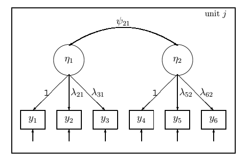
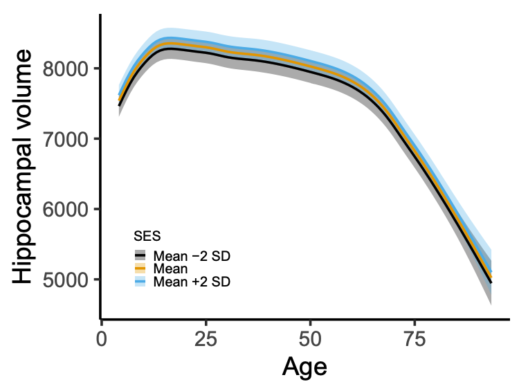

```{r, echo=FALSE, message=FALSE, warning=FALSE}
library(mgcv)
library(lme4)
library(tidyverse)
library(ggthemes)
theme_set(theme_bw())
theme_update(panel.grid = element_blank())
```


# Outline

- Overview of latent variable models

- A framework for semiparametric latent variable modeling

- Maximum likelihood estimation

- Applications


---

class: inverse, middle, center

# Overview of Latent Variable Models


---

## Confirmatory Factor Analysis

A set of items measure some underlying construct(s)

$$\mathbf{y}_{j} = \boldsymbol{\Lambda} \boldsymbol{\eta}_{j} + \boldsymbol{\epsilon}_{j}, \qquad \boldsymbol{\eta}_{j} \sim N\left(\mathbf{0}, \boldsymbol{\Psi}\right)$$

<br>
<center>

</center>

---

## Item Response Theory

Kind of factor analysis with binomial measurements:

$$\mathbf{y}_{j} \sim \text{Binomial}\left(\boldsymbol{\mu}_{j}\right)$$ 

Predictor

$$\boldsymbol{\nu}_{j} = \log\left(\frac{\boldsymbol{\mu}_{j}}{\mathbf{1} - \boldsymbol{\mu}_{j}}\right) =  \mathbf{X}\boldsymbol{\beta} + \boldsymbol{\Lambda} \boldsymbol{\eta}_{j}, \qquad \boldsymbol{\eta}_{j} \sim N\left(\mathbf{0}, \boldsymbol{\Psi}\right)$$


---


## Structural Equation Models


---


## Structural Equation Models


- Measurement model for response:

$$\mathbf{y}_{j} = \boldsymbol{\Lambda}_{y} \boldsymbol{\eta}_{j} + \boldsymbol{\epsilon}_{j}, \qquad \boldsymbol{\epsilon}_{j} \sim N(\mathbf{0}, \boldsymbol{\Psi}_{y})$$

- Measurement model for predictors:

$$\mathbf{x}_{j} = \boldsymbol{\Lambda}_{x} \boldsymbol{\xi}_{j} + \boldsymbol{\delta}_{j}, \qquad \boldsymbol{\xi}_{j} \sim N\left(\mathbf{0}, \boldsymbol{\Psi}_{x}\right)$$

- Structural model:

$$\boldsymbol{\eta}_{j} = \mathbf{B}\boldsymbol{\eta}_{j} + \boldsymbol{\Gamma} \boldsymbol{\xi}_{j} + \boldsymbol{\zeta}_{j}, \qquad \boldsymbol{\zeta}_{j} \sim N\left(\mathbf{0}, \boldsymbol{\Psi}\right)$$

---


## Generalized Linear Mixed Models

- Measurement model for response

$$\mathbf{y}_{j} = \boldsymbol{\mu}_{j} + \boldsymbol{\epsilon}_{j}$$

with $\boldsymbol{\epsilon}_{j}$ distributed according to exponential family.

- Mean of $\mathbf{y}_{j}$ depends on latent variables $\boldsymbol{\eta}_{j}$

$$\boldsymbol{\mu}_{j} = g^{-1}\left(\mathbf{X}_{j} \boldsymbol{\beta} + \mathbf{Z}_{j} \boldsymbol{\eta}_{j}\right),  \qquad \boldsymbol{\eta}_{j} \sim N\left(\mathbf{0}, \boldsymbol{\Psi}\right)$$


---

class: inverse, middle, center

# Generalized Linear Latent and Mixed Models

All models mentioned above, and many more, are special cases of GLLAMM.

.footnote[Rabe-Hesketh, S., Skrondal, A., & Pickles, A. (2004). Generalized multilevel structural equation modeling. Psychometrika, 69(2), 167--190. https://doi.org/10.1007/BF02295939]

---


## GLLAMM


- Exponential family response, possibly of mixed type.

- $L$ grouping levels. $M_{l}$ latent variables at $l$th level.

Linear predictor:

$$\nu_{i} = \mathbf{x}_{i}^{T}\boldsymbol{\beta} + \sum_{l=2}^{L} \sum_{m=1}^{M_{l}} \eta_{m}^{(l)} \mathbf{z}_{mi}^{(l)}{}^{T} \boldsymbol{\lambda}_{m}^{(l)}$$

Structural model

$$\boldsymbol{\eta}_{j} = \mathbf{B}\boldsymbol{\eta}_{j} +\boldsymbol{\Gamma} \mathbf{w}_{j} + \boldsymbol{\zeta}_{j}, \qquad \boldsymbol{\zeta}_{j} \sim N\left(\mathbf{0}, \boldsymbol{\Psi}\right)$$


---

## GLLAMM

Lots of applications in the social sciences, but there are some limitations:

1. Strictly parametric.

2. Crossed random effects not really supported.

3. Stata based. Limited availability in R.

We'll address these things one at a time.


---

class: inverse, middle, center

# Thing 1

"GLLAMMs are strictly parametric."


---

## Semiparametric Estimation often Needed

- The world is nonlinear.

- Easier and safer to learn the nonlinear form from the data, rather than pulling a parameteric model out of the hat.

Example: how many words people remember, plotted against age.

<center>

</center>


---

## Generalized Additive Latent and Mixed Models 

Extension of GLLAMM framework to incorporate smooth functions of observed variables.

- Linear predictor

$$\nu_{i} = \sum_{s=1}^{S}f_{s}\left(\mathbf{x}_{i}\right) + \sum_{l=2}^{L} \sum_{m=1}^{M_{l}} \eta_{m}^{(l)} \mathbf{z}_{mi}^{(l)}{}^{T} \boldsymbol{\lambda}_{m}^{(l)}$$

- Structural model

$$\boldsymbol{\eta}_{j} = \mathbf{B}\boldsymbol{\eta}_{j} + \mathbf{h}\left( \mathbf{w}_{j} \right) + \boldsymbol{\zeta}_{j}, \qquad \boldsymbol{\zeta}_{j} \sim N\left(\mathbf{0}, \boldsymbol{\Psi}\right)$$

Smooth functions $f_{s}(\cdot)$ and $\mathbf{h}(\cdot)$ are linear combinations of known basis functions (regression splines), with squared second derivative penalization.


---

## Semiparametric Estimation

Might have a basis like this.

```{r, echo=FALSE, dev='svg', fig.height=3.5, fig.width=7, fig.align='center'}
set.seed(2) ## simulate some data... 
dat <- gamSim(1,n=400,dist="normal",scale=2, verbose=FALSE)

mod <- gam(y ~ s(x2, k = 6, bs = "cr"), data = dat, method="ML")
dat <- dat %>% 
  mutate(pred = predict(mod))

Xp <- predict(mod, type = "lpmatrix")
p0 <- as_tibble(Xp) %>% 
  mutate(x2 = dat$x2) %>% 
  pivot_longer(cols = -x2) %>% 
  ggplot(aes(x = x2, y = value, group = name, color = name)) + 
  geom_line() +
  scale_color_colorblind() +
  labs(color = NULL)
  
sm <- smoothCon(s(x2, k = 6, bs = "cr"), data = dat)[[1]]
re <- smooth2random(sm, "")
pm <- cbind(attr(re$rand$g, "Xr"), re$Xf)
colnames(pm) <- paste0("s", 1:ncol(pm))

grid <- as_tibble(pm) %>% 
  mutate(x2 = dat$x2) %>% 
  pivot_longer(cols = -x2) %>% 
  mutate(
    type = case_when(
      str_detect(name, "[1-4]") ~ "In penalty range space",
      TRUE ~ "In penalty nullspace"
    )
  )

p1 <- ggplot(grid, aes(x = x2, y = value, group = name, color = name)) + 
  geom_line() +
  labs(color = NULL) +
  scale_color_colorblind()

p0
```


---

## Semiparametric Estimation

Basis can be transformed:

.pull-left[

```{r, echo=FALSE, dev='svg', fig.height=3.5, fig.width=6, fig.align='center'}
p0
```

]
.pull-right[

```{r, echo=FALSE, dev='svg', fig.height=3.5, fig.width=6, fig.align='center'}
p1
```

]


---

## Semiparametric Estimation

Look closer at the transformed basis:

```{r, echo=FALSE, dev='svg', fig.height=3.5, fig.width=8, fig.align='center'}
p1 + 
  facet_wrap(vars(type)) +
  ggtitle("Second derivative penalization")
```


.footnote[Dates back to: Kimeldorf, G. S., & Wahba, G. (1970). A Correspondence Between Bayesian Estimation on Stochastic Processes and Smoothing by Splines. Annals of Mathematical Statistics, 41(2), 495–502. https://doi.org/10.1214/aoms/1177697089
]

---

## GLLAMMs with Semiparametric Functions

- We show that GLLAMMs with semiparametric functions can be transformed to classical parametric GLLAMMs and estimated by the same method.

---

## GLLAMMs with Semiparametric Functions


- Part of basis in penalty nullspace becomes fixed effects.

- Part of basis in penalty rangespace becomes random effects.

- Inverse smoothing parameter becomes just another variance component to be estimated.

--

- Gets a bit nasty. In the words of reviewer 3

> ... the notation in this paper is so dreadful that I considered declining to review it. If the notation is not thoroughly cleaned up in a revision, I will not review it again. I only begin to touch the surface in these comments.
(...) The lack of consistency seems almost sadistic, as if it was done to purposively make even simple expressions inscrutable! 


---

class: inverse, middle, center

# Anyhow


---

class: inverse, middle, center

# Thing 2

"Crossed random effects not really supported."


---

class: inverse, middle, center

# A Scalable Algorithm

Laplace approximation, sparse matrices, and autodiff to the rescue

---

# Likelihood

- Transform latent variables through $\boldsymbol{\Lambda} \mathbf{u} = \boldsymbol{\zeta}$, where $\boldsymbol{\Lambda}^{T}\boldsymbol{\Lambda} = \boldsymbol{\Psi}$, so $\mathbf{u} \sim N(\mathbf{0}, \phi_{1} \mathbf{I})$. $\phi_{1}$ is a reference level, since the dispersion may differ between observations.

- The marginal likelihood, integrating over $\mathbf{u} \in \mathbb{R}^{r}$ is

$$L\left(\boldsymbol{\beta}, \boldsymbol{\Lambda}, \boldsymbol{\Gamma}, \boldsymbol{\lambda}, \mathbf{B}, \boldsymbol{\phi}\right)  = \\ \left(2 \pi \phi_{1}\right)^{-r/2}  \int_{\mathbb{R}^{r}} \exp\left( g\left(\boldsymbol{\beta}, \boldsymbol{\Lambda}, \boldsymbol{\Gamma}, \boldsymbol{\lambda}, \mathbf{B}, \boldsymbol{\phi}, \mathbf{u}\right) \right) \text{d} \mathbf{u}$$

where

$$g\left(\boldsymbol{\beta}, \boldsymbol{\Lambda}, \boldsymbol{\Gamma}, \boldsymbol{\lambda}, \mathbf{B}, \boldsymbol{\phi}, \mathbf{u}\right) = \\ 
\mathbf{y}^{T} \mathbf{W}\boldsymbol{\nu} - d\left(\boldsymbol{\nu}\right)^{T} \mathbf{W}\mathbf{1}_{n}  + c\left(\mathbf{y}, \boldsymbol{\phi}\right)^{T} \mathbf{1}_{n} - \left(2\phi_{1}\right)^{-1} \left\| \mathbf{u} \right\|^{2}$$

- Just like a generalized linear mixed model, except that everything depends on the factor loadings and coefficients for regressions between latent variables. Doubly nonlinear in a sense.


---

## Laplace Approximation

- First goal, maximize the exponent in the integrand at fixed parameters.

$$\tilde{\mathbf{u}} = \underset{\mathbf{u}}{\text{argmax}} \left\{ g\left(\boldsymbol{\beta}, \boldsymbol{\Lambda}, \boldsymbol{\Gamma}, \boldsymbol{\lambda}, \mathbf{B}, \phi, \mathbf{u}\right) \right\}$$

- Analytical expressions for gradient and Hessian

$$\nabla g = \boldsymbol{\Lambda}^{T} \mathbf{Z}^{T} \mathbf{W}\left( \mathbf{y} - \boldsymbol{\mu} \right)  - \left(1/\phi_{1}\right)\mathbf{u}$$

$$\mathbf{H}_{g} =-  \boldsymbol{\Lambda}^{T} \mathbf{Z}^{T} \mathbf{V}  \mathbf{Z} \boldsymbol{\Lambda} - \left(1/\phi_{1}\right) \mathbf{I}_{r}$$

- Full Newton method:

$$\nabla g^{(k)} \boldsymbol{\delta}^{(k)} = \mathbf{H}_{g}^{(k)}$$

and then updating $\mathbf{u}^{(k+1)} = \mathbf{u}^{(k)} + \gamma \boldsymbol{\delta}^{(k)}$ for some adaptively chosen stepsize $\gamma$.


---

## Laplace Approximation

- Linear system

$$\nabla g^{(k)} \boldsymbol{\delta}^{(k)} = \mathbf{H}_{g}^{(k)}$$

- Hessian $\mathbf{H}_{g}^{(k)}$ is typically **really really sparse**. Sparse Cholesky factorization

$$\mathbf{L}^{(k)} \mathbf{D}^{(k)} \mathbf{L}^{(k)}{}^{T} = \mathbf{P} \mathbf{H}_{g}^{(k)}\mathbf{P}^{T}$$
- Fill-reducing permutation $\mathbf{P}$ only depends on location of structural zeros, so can be computed off-line.

- The actual system we solve is

$$\mathbf{L}^{(k)} \mathbf{D}^{(k)} \mathbf{L}^{(k)T} \mathbf{P} \boldsymbol{\delta}^{(k)} = \mathbf{P} \left( \boldsymbol{\Lambda}^{T} \mathbf{Z}^{T} \mathbf{W}^{(k)} \left( \mathbf{y} - \boldsymbol{\mu}^{(k)}\right)- (1/\phi_{1}^{(k)}) \mathbf{u}^{(k)}\right)$$


---

## Log-Likelihood

- Laplace approximation: plug in conditional modes $\tilde{\mathbf{u}}$ at convergence and update all other terms that depend on $\mathbf{u}$.

- Laplace approximate marginal likelihood is

$$\log L\left(\boldsymbol{\beta}, \boldsymbol{\Lambda}, \boldsymbol{\Gamma}, \boldsymbol{\lambda}, \mathbf{B}, \boldsymbol{\phi}\right) = \\ \mathbf{y}^{T} \mathbf{W}\boldsymbol{\nu} - d\left(\boldsymbol{\nu}\right)^{T} \mathbf{W}\mathbf{1}_{n}  + c\left(\mathbf{y}, \boldsymbol{\phi}\right)^{T} \mathbf{1}_{n} - \left(2\phi_{1}\right)^{-1} \left\| \tilde{\mathbf{u} }\right\|^{2} - (1/2)\log \text{tr}\left(\mathbf{D}\right)$$

- Gradient not analytically tractable, but can be computed to machine precision using algorithmic differentiation.

- Gradients are then used by the quasi-Newton method L-BFGS-B to find the maximum inside the feasible set.


---

class: inverse, middle, center


Isaac and his cousin Fred Quasi-Newton inventing the rainbow.

---

class: inverse, middle, center


# Thing 3

Stata based. Limited availability in R.


---

## Implementation

- R package `galamm`, so far only at https://lcbc-uio.github.io/galamm/.

- Supports a wide range of models, including

  - Mixed response types
  
  - Crossed random effects
  
  - Semiparametric terms
  
  - Heteroscedasticity
  

- User-friendly API will come when numerics is settled.


---

class: inverse, middle, center

# Application Examples


---


# Coupled Cognitive Change

<center>

<br>
<br>
<br>

</center>


---

# Coupled Cognitive Change


---

# Effect of Socioeconomic Status on the Brain

- A Lancet report has suggested that low socioeconomic status is a risk factor for late life dementia, through its impact on brain structure.

- Lifespan brain development is pretty nonlinear. Example below shows volume of hippocampus. How does socioeconomic status interact with this curve?

<center>

</center>

---

# Effect of Socioeconomic Status on the Brain


.pull-left[

- Latent socioeconomic status defined by income and education level. 

- For children, parents' values were used.
]
.pull-right[

]

---

class: inverse, middle, center

# Further Work

---

## Further Work

- Study the accuracy of Laplace approximation through importance sampling.

- Smooth functions of latent variables. Leads to $\chi^{2}$ distributed random variables.

- Optimize code and create descent API.

- Utilize the framework to answer research questions in cognitive neuroscience.


Interested in working with similar applications? Postdoc position will soon be announced. Contact me for details.


---

class: inverse, middle, center

# Implementation Details

---

## Autodiff and Sparse Matrices

- Sparse matrix computations in C++ using Eigen (https://eigen.tuxfamily.org/).

- Rather than `float` or `double`, we fill the Eigen matrices with dual numbers from autodiff (https://autodiff.github.io/), tracing derivatives in the computational graph.

  - First-order dual numbers during optimization with L-BFGS-B to get gradient.
  - Second-order dual numbers at convergence, to get exact Hessian, and thus covariance matrix.
  
--

- Updating $\mathbf{X}$ and $\mathbf{Z}$ at each likelihood evaluation, since they contain parameters. Solved by mapping parameters to values in the compressed sparse column representation of sparse matrices.

- Mapping between R and C++ objects using RcppEigen, and base R's `optim()` function for likelihood maximization.


---

## Autodiff

- Scalar valued function `f()` taking vector arguments

```{Rcpp, eval=FALSE}
#include <autodiff/forward/dual.hpp>
#include <autodiff/forward/dual/eigen.hpp>
using namespace autodiff;

template <typename T>
T f(const Eigen::Array<T, Eigen::Dynamic, 1>& x)
{
    return (x * x.exp()).sum();
}

```


---

## Autodiff

- Scalar type defines what you can get:

```{Rcpp, eval=FALSE}
int main()
{
    ArrayXdual1st x(5); // 1st derivative = gradient
    x << 1, 2, 3, 4, 5;
    Eigen::VectorXd g = gradient(f<dual1st>, wrt(x), at(x));
    
    ArrayXdual2nd y(5); // 2nd derivative = Hessian
    y << 1, 2, 3, 4, 5;
    Eigen::MatrixXd H = hessian(f<dual2nd>, wrt(y), at(y));
    
    Eigen::ArrayX<double> z(5); // only function value
    z << 1, 2, 3, 4, 5;
    double u = f<double>(z);
}
```


- Log-likelihood implementation for GALAMMs contains classes, header files, branching, and loops, but autodiff faithfully gives exact derivatives.


---

class: inverse, middle, center
 
# Thank you
